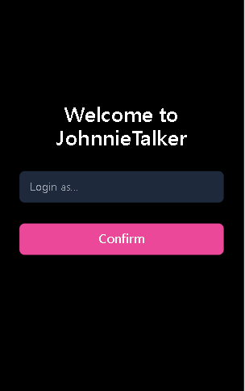

# Johnnie Talker

Chat App built with React.js +Socket.io + Node.js

With RWD, it will look like this in mobile phone.

Let's login to continue, choose a great name, if username is already taken, alert message will show up.

Furthermore, username cannot be empty.

If there is a new user, an announcement will be published immediately

Check if the user has scrolled to the bottom automatically, if not, an arrow icon with scroll to bottom function will appear

### Invite your crush and start a conversation now! Have fun and I hope you like it~

 
 

# Thank you for your visit! Have a nice day!
